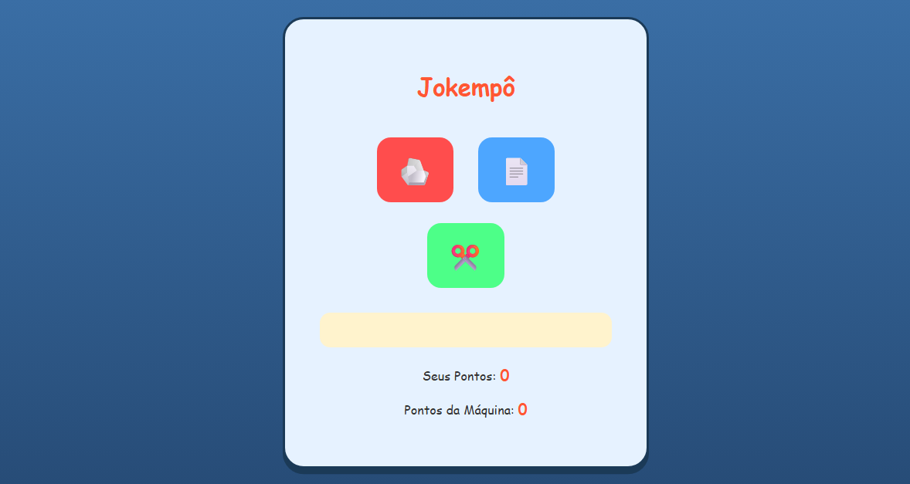

# 🎮 Jogo Pedra, Papel e Tesoura

Esse foi um dos projetos que fiz para praticar JavaScript na prática.  
A ideia é simples: jogar Pedra, Papel e Tesoura contra o computador e ver quem vence.

---

## 🚀 Tecnologias usadas

  
  
  

---

## 💻 O que o jogo faz

- Você escolhe entre pedra, papel ou tesoura  
- O computador faz uma escolha aleatória  
- O resultado aparece na tela  
- Existe um contador para acompanhar as vitórias  

É um projeto simples, mas que já envolve bastante lógica.

---

## 🧠 O que eu pratiquei nesse projeto

- Manipulação do DOM
- Uso de `addEventListener`
- Condições com `if/else`
- Geração de valores aleatórios
- Organização melhor do CSS
- Responsividade com media queries

Esse projeto me ajudou a entender melhor como conectar HTML com JavaScript de forma prática.

---

## 📱 Responsividade

Funciona tanto no computador quanto no celular.  
Adaptei os tamanhos e espaçamentos para não quebrar o layout em telas menores.

---

## 📸 Preview

  

